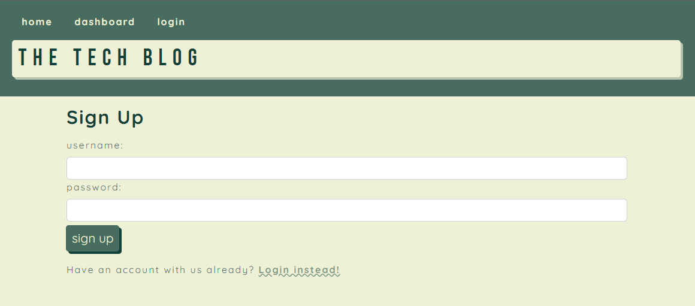
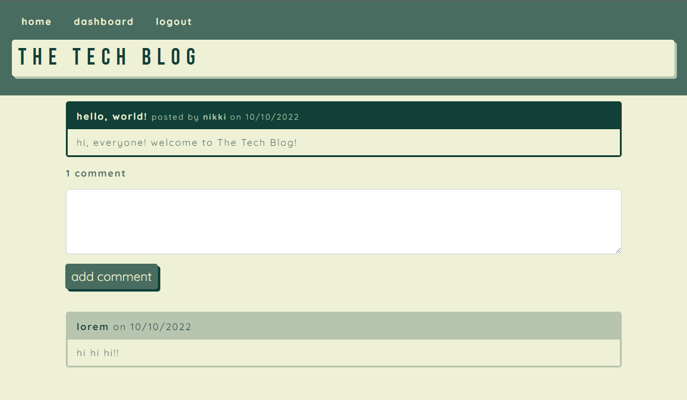
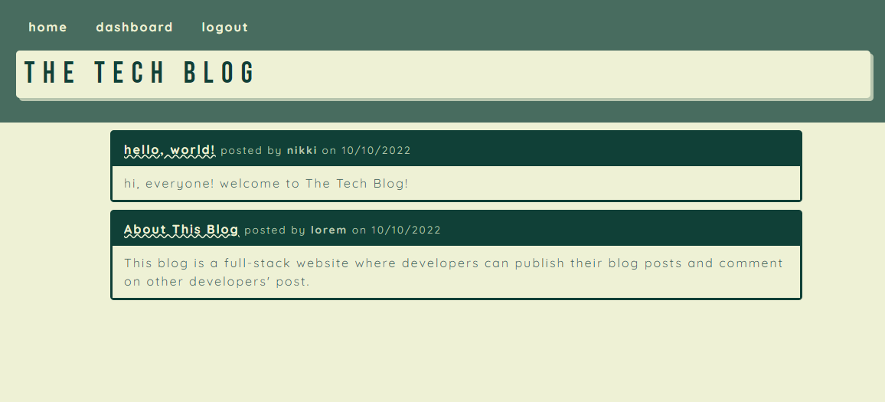
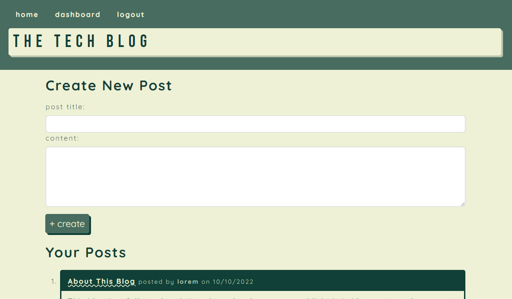
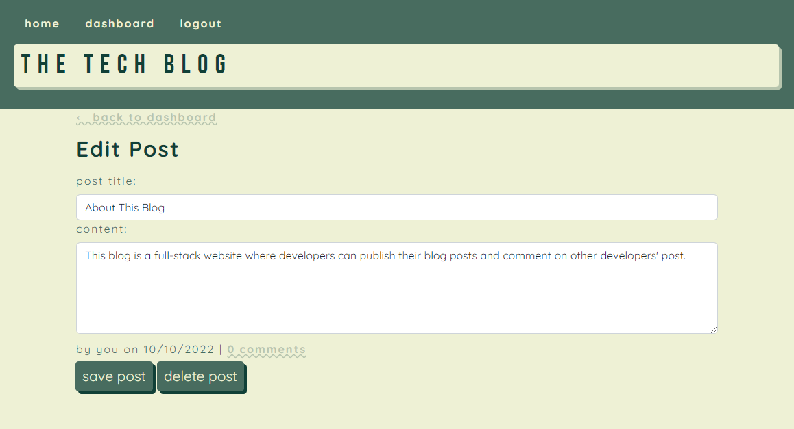

# Module #14 Challenge: The Tech Blog

## Description

This project is a **full-stack blog site** where developers can publish their blog posts and comment on other developers' post. This site was built completely from scratch and is deployed on Heroku. This application follows the **Model-View-Controller (MVC)** architectural structure, utilizes **Handlebar.js** as the template engine, **Sequelize** as the ORM, and the **express-session** npm package for authentication.

[Check out the deployed application here!](https://afternoon-chamber-17636.herokuapp.com/)

## Table of Contents

* [Screenshots](#screenshots)
* [Questions](#questions)

## Screenshots

## Questions

If you have any questions about this repository, please open an issue. You can also find more of my work at [desguerra](https://github.com/desguerra) on GitHub.